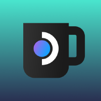

<div align="center">



# Mobile Mode

**A third operating mode for your Steam Deck — touch-first, vertical, fully Linux.**

[](LICENSE)
[](plugin.json)
[](https://store.steampowered.com/steamos)
[](https://github.com/SteamDeckHomebrew/decky-loader)

<a href="https://buymeacoffee.com/nord.winter">
  
</a>

</div>

---

## What is Mobile Mode?

Steam Deck has two built-in modes: **Gaming** and **Desktop**. Mobile Mode adds a third.

One tap in the Power Menu switches your Deck into a **portrait-oriented, touch-first KDE session** — no extra packages, no Plasma Mobile, no hacks. Everything needed is already in SteamOS 3.8.

| Gaming Mode | Desktop Mode | **Mobile Mode** |
|-------------|--------------|----------------|
| Gamescope, controller | KDE landscape | **KDE portrait · touch · Maliit keyboard** |
| Games | Linux apps (mouse) | **Linux apps (finger)** |
| Steam UI | Full desktop | **Vertical · thumb-friendly** |

### What you get

- Portrait screen orientation (90° rotation via `kscreen-doctor`)
- Maliit virtual keyboard — auto-invokes on every text input
- Full Linux app access: browser, Telegram, media player, files
- "Switch to Mobile" button natively in the Steam Power Menu
- "Return to Gaming" one-tap button inside the KDE session
- Persistent across SteamOS updates (files reinstalled on every plugin load)

---

## Installation

> **Requires [Decky Loader](https://github.com/SteamDeckHomebrew/decky-loader)**

### From Decky Store *(coming soon)*

Search for **"Mobile Mode"** in the Decky plugin store.

### Manual install

1. Download the latest release `.zip` from [Releases](https://github.com/nord-winter/decky-mobile-mode/releases)
2. In Decky → Settings → **Install plugin from zip**

---

## How it works

```
Power Menu → "Switch to Mobile"
  └─ Decky backend (root) installs session files
  └─ steamosctl switches to mobile.desktop
  └─ KDE starts via plasma-dbus-run-session-if-needed
  └─ autostart: kscreen-doctor rotates screen · maliit-server starts
  └─ KDE in portrait mode ✓

KDE → "Return to Gaming"
  └─ kscreen-doctor restores landscape
  └─ steamosctl switch-to-game-mode
```

No extra packages required — `KWin`, `maliit-keyboard`, `kscreen-doctor` and `steamosctl` are all pre-installed in SteamOS 3.8.

---

## Architecture

```
decky-mobile-mode/
├── src/index.tsx              # Frontend: Power Menu patch · QAM panel
├── main.py                    # Backend (root): steamosctl · file management
└── assets/
    ├── mobile.desktop         # Wayland session descriptor
    ├── startplasma-mobile.sh  # KDE session launcher (Maliit env)
    ├── mobile-mode-init.sh    # Autostart: rotation + maliit-server
    ├── return-to-gaming.sh    # Switch back to Gaming Mode
    └── return-to-gaming.desktop
```

### Power Menu patch

The "Switch to Mobile" button is injected into Steam's Power Menu at runtime. The approach is update-resistant — no hardcoded webpack module IDs, components are identified by stable content strings:

| Target | Identified by |
|--------|--------------|
| `showContextMenu` | `CreateContextMenuInstance` + `GetContextMenuManagerFromWindow` |
| Power Menu component | render source contains `ShutdownPC` + `IN_GAMESCOPE` |

Research conducted via CEF DevTools on SteamOS 3.8.2 (Steam build Apr 11 2026). Full technical notes in [`.claude/CLAUDE.md`](.claude/CLAUDE.md).

---

## Development

### Requirements

- Node.js ≥ 16.14
- pnpm v9+ (`npm i -g pnpm@9`)
- Steam Deck or SteamOS VM for testing

### Build

```bash
pnpm i
pnpm run build    # → dist/index.js
pnpm run watch    # watch mode
```

### Deploy to device

```bash
# Configure your device IP
echo 'DECK_IP=192.168.1.x' >> .vscode/config.sh

# Deploy via VSCode task or:
ssh deck@<IP> "..."
```

### Debug

```bash
# Session log on device
cat ~/.config/mobile-mode/session.log

# Decky plugin logs
ssh deck@<IP> "journalctl -u plugin_loader -f"

# CEF DevTools (Power Menu research)
ssh -L 8080:localhost:8080 deck@<IP> -N
# → http://localhost:8080 → SharedJSContext
```

---

## Roadmap

- [x] Phase 0 — Research (steamosctl, Maliit, kscreen-doctor verified)
- [x] Phase 1 — MVP shell scripts (tested on device)
- [ ] Phase 2 — Decky plugin *(current)*
  - [x] Power Menu patch — "Switch to Mobile"
  - [x] Python backend
  - [x] Return to Gaming
  - [x] QAM mode indicator
  - [ ] On-device testing
- [ ] Phase 3 — UX polish (KWin rules, smooth transitions, gestures)
- [ ] Phase 4 — Decky Store submission

---

## Support

If Mobile Mode saves you from squinting at landscape apps — consider buying me a coffee ☕

<a href="https://buymeacoffee.com/nord.winter">
  
</a>

---

## License

GPL-3.0-or-later © 2026 [nord-winter](https://github.com/nord-winter)

Plugin template originally by [Steam Deck Homebrew](https://github.com/SteamDeckHomebrew/decky-plugin-template) — BSD-3-Clause.
